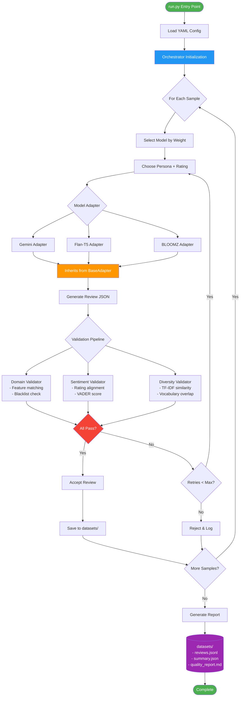

# 🏗️ Synthetic Review Generator - System Design

A production-ready system for generating high-quality synthetic product reviews using multiple LLM providers with built-in quality validation.

---

## 📋 Table of Contents

1. [System Overview](#-system-overview)
2. [Architecture Diagram](#-architecture-diagram)
3. [Entry Point & Flow](#-entry-point--flow)
4. [Model Adapters](#-model-adapters)
5. [Validation System](#-validation-system)
6. [Orchestrator](#-orchestrator)
7. [Configuration](#-configuration)
8. [Output & Storage](#-output--storage)

---

## 🎯 System Overview

### What This System Does

The Synthetic Review Generator creates realistic, diverse product reviews using multiple LLM models. It ensures quality through a multi-stage validation pipeline and saves all outputs to the `datasets/` directory.

**Key Features:**
- ✅ Multi-model support with weighted selection
- ✅ Base adapter pattern for easy extensibility
- ✅ Three-tier validation (Domain, Sentiment, Diversity)
- ✅ Automatic regeneration on validation failure
- ✅ Comprehensive reporting and metrics

---

## 🔄 Architecture Diagram



---

## 🚀 Entry Point & Flow

### `run.py` - Entry Point

The `run.py` script is the **main entry point** for the entire system. It:

1. Loads the YAML configuration file
2. Initializes all model adapters
3. Creates the orchestrator instance
4. Starts the generation process

**Usage:**
```bash
python run.py --config configs/pmtool.yaml
```

### Execution Flow

```
run.py
  ↓
Orchestrator.__init__()
  ↓
For each sample_count:
  → Select model (weighted random)
  → Choose persona + rating
  → Generate review via adapter
  → Validate (domain → sentiment → diversity)
  → Accept or regenerate
  ↓
Save to datasets/run_[timestamp]/
  → reviews.jsonl
  → summary.json
  → quality_report.md
```

---

## 🤖 Model Adapters

### Base Adapter Pattern

All model adapters inherit from **`BaseAdapter`**, which defines the standard interface:

```python
class BaseAdapter(ABC):
    @abstractmethod
    def generate(self, prompt: str, max_tokens: int, temperature: float) -> GenerationResult:
        """Generate text from the model"""
        pass
```

### Implemented Adapters

I've implemented multiple model adapters that inherit from the base:

1. **`GeminiAdapter`** - Google Gemini Flash 1.5
   - Fast, reliable, excellent JSON adherence
   - **Weight:** Configurable (typically 60%)
   - **Cost:** Free tier

2. **`FlanT5Adapter`** - Google Flan-T5 (via HuggingFace)
   - Instruction-tuned T5 model
   - **Weight:** Configurable (typically 20%)
   - **Use:** Adds diversity in writing style

3. **`BLOOMZAdapter`** - BLOOMZ (via HuggingFace)
   - Multilingual capability
   - **Weight:** Configurable (typically 20%)
   - **Use:** Different generation patterns

### Model Selection Logic

Models are selected using **weighted random sampling** based on persona and configuration:

```yaml
models:
  - name: "gemini"
    weight: 0.6    # 60% probability
  - name: "flan-t5"
    weight: 0.2    # 20% probability
  - name: "bloomz"
    weight: 0.2    # 20% probability
```

### Why Multiple Models?

✅ **Diversity** - Different models have different writing styles  
✅ **Comparison** - Benchmark quality, speed, and acceptance rates  
✅ **Robustness** - Fallback if one model fails  
✅ **Realism** - More varied outputs resemble real user reviews

---

## ✅ Validation System

The system uses **three independent validation modules** to ensure quality:

### 1️⃣ Domain Validator (`validators/domain.py`)

**Purpose:** Ensure reviews mention realistic features and avoid impossible claims.

**How it works:**
- Checks for **feature lexicon matches** (e.g., "timeline", "board view", "automation")
- Detects **blacklisted terms** (e.g., "quantum compiler", "time travel")
- Calculates domain score: `features_found / total_features`

**Configuration:**
```yaml
feature_lexicon:
  features: ["kanban", "sprint", "integration", "timeline"]
  blacklist: ["teleportation", "quantum", "magic"]
```

**Rejection Example:**
```json
{
  "title": "Amazing Quantum Integration",
  "body": "This tool uses quantum computing to plan sprints..."
}
```
❌ **Rejected** - Contains blacklisted term "quantum"

---

### 2️⃣ Sentiment Validator (`validators/sentiment.py`)

**Purpose:** Ensure the sentiment of the review text matches the rating.

**How it works:**
- Uses **VADER sentiment analysis** to score text (-1 to +1)
- Compares sentiment to expected range based on rating:
  - Rating 1-2 → Negative sentiment expected
  - Rating 3 → Neutral sentiment expected
  - Rating 4-5 → Positive sentiment expected
- Allows tolerance for edge cases (configurable)

**Configuration:**
```yaml
quality_thresholds:
  sentiment_tolerance: 0.6  # How much variance is allowed
```

**Rejection Example:**
```json
{
  "rating": 1,
  "body": "Absolutely love this tool! It's perfect in every way!"
}
```
❌ **Rejected** - Positive sentiment but rating is 1/5

---

### 3️⃣ Diversity Validator (`validators/diversity.py`)

**Purpose:** Prevent repetitive or overly similar reviews.

**How it works:**
- Calculates **TF-IDF vectors** for each review
- Computes **cosine similarity** against all existing reviews
- Checks **vocabulary overlap** (Jaccard similarity)
- Rejects if similarity exceeds threshold (default: 0.92)

**Configuration:**
```yaml
quality_thresholds:
  max_similarity: 0.92  # Maximum allowed similarity
```

**Why Diversity Matters:**
Real reviews have natural variation in:
- Word choice
- Phrasing
- Feature mentions
- Writing style

If all reviews sound identical, the dataset is unrealistic.

---

## 🎛️ Orchestrator

### Role

The **Orchestrator** (`orchestrator.py`) is the central control system that:

1. **Manages the generation loop** - Iterates through sample counts
2. **Handles adapter selection** - Weighted random selection
3. **Coordinates validation** - Runs all validators in sequence
4. **Implements retry logic** - Regenerates on failure (up to max attempts)
5. **Tracks metrics** - Latency, acceptance rates, model performance
6. **Saves outputs** - Writes to `datasets/` directory

### Orchestrator Flow

```
Initialize:
  - Load config
  - Create adapters (Gemini, Flan-T5, BLOOMZ)
  - Initialize validators (Domain, Sentiment, Diversity)
  - Prepare storage

Generate Loop:
  For i in range(sample_count):
    1. Select model (weighted random)
    2. Sample persona from config
    3. Sample rating from distribution
    4. Build prompt
    5. Call adapter.generate()
    6. Validate result:
       → Domain check
       → Sentiment check
       → Diversity check
    7. If all pass → accept and save
    8. If any fail → regenerate (up to max_attempts)
    9. Track metrics

Finalize:
  - Save reviews.jsonl
  - Save summary.json
  - Generate quality_report.md
```

### Retry Logic

If validation fails:
1. First retry: Same model, different temperature
2. Second retry: Different model (next in weighted list)
3. After max attempts: Reject and log failure

This prevents infinite loops while maximizing acceptance.

---

## ⚙️ Configuration

### YAML Structure

Configuration is defined in `configs/pmtool.yaml`:

```yaml
domain: "Project Management SaaS"
sample_count: 500

models:
  - name: "gemini"
    weight: 0.6
  - name: "flan-t5"
    weight: 0.2
  - name: "bloomz"
    weight: 0.2

personas:
  - name: "marketing_manager"
    background: "Works in a small agency"
    voice_style: "friendly, casual"
  
  - name: "devops_engineer"
    background: "Senior Linux admin"
    voice_style: "technical, concise"

rating_distribution:
  1: 10   # 10% 1-star
  2: 10   # 10% 2-star
  3: 20   # 20% 3-star
  4: 40   # 40% 4-star
  5: 20   # 20% 5-star

feature_lexicon:
  features:
    - "kanban"
    - "sprint planning"
    - "timeline"
    - "automation"
    - "integration"
  blacklist:
    - "quantum"
    - "teleportation"
    - "magic"

quality_thresholds:
  domain_score_min: 0.05
  sentiment_tolerance: 0.6
  max_similarity: 0.92

regeneration:
  max_attempts: 2
```

---

## 💾 Output & Storage

### Storage Location

**Everything** is saved to `datasets/run_[timestamp]/`:

```
datasets/
└── run_20251130T180032Z/
    ├── reviews.jsonl        # All accepted reviews
    ├── summary.json         # Generation statistics
    └── quality_report.md    # Human-readable report
```

### Output Files

#### 1. `reviews.jsonl`

Each line is a complete review with metadata:

```json
{
  "title": "Great Timeline Feature",
  "body": "We've been using this for 6 months...",
  "rating": 4,
  "persona": "marketing_manager",
  "model": "gemini-1.5-flash",
  "date": "2024-08-15",
  "tags": ["timeline", "integration"],
  "quality": {
    "passed": true,
    "domain": {"score": 0.85, "features_found": ["timeline", "integration"]},
    "sentiment": {"score": 0.68, "expected_range": [0.2, 1.0]},
    "diversity": {"similarity": 0.43}
  }
}
```

#### 2. `summary.json`

Aggregated statistics:

```json
{
  "total_generated": 523,
  "total_accepted": 500,
  "rejection_rate": 0.044,
  "rejection_reasons": {
    "domain": 12,
    "sentiment": 8,
    "diversity": 3
  },
  "model_performance": {
    "gemini": {"avg_latency": 0.8, "acceptance_rate": 0.96},
    "flan-t5": {"avg_latency": 1.2, "acceptance_rate": 0.91},
    "bloomz": {"avg_latency": 1.4, "acceptance_rate": 0.88}
  }
}
```

#### 3. `quality_report.md`

Human-readable markdown report with:
- Generation summary
- Validation statistics
- Model comparison
- Sample reviews

---

## 🎓 Key Design Decisions

### Why Base Adapter Pattern?

✅ **Extensibility** - Easy to add new models  
✅ **Consistency** - All adapters return same format  
✅ **Testing** - Can mock adapters for unit tests  
✅ **Maintenance** - Changes to interface affect all adapters

### Why Three Separate Validators?

✅ **Separation of Concerns** - Each validator has one job  
✅ **Modularity** - Easy to add/remove validators  
✅ **Debugging** - Know exactly which check failed  
✅ **Configuration** - Tune thresholds independently

### Why Weighted Model Selection?

✅ **Control** - Prioritize better-performing models  
✅ **Diversity** - Still get variety from other models  
✅ **Cost Management** - Limit expensive API calls  
✅ **A/B Testing** - Compare different weightings

---

## 🚦 Quality Thresholds Explained

| Validator | Metric | Threshold | Purpose |
|-----------|--------|-----------|---------|
| **Domain** | Feature mentions | ≥ 0.05 | At least 1 feature mentioned |
| **Domain** | Blacklist | 0 matches | No impossible features |
| **Sentiment** | VADER score alignment | Within ±0.6 | Rating matches sentiment |
| **Diversity** | TF-IDF similarity | ≤ 0.92 | Not too similar to existing reviews |

These can be tuned in `configs/pmtool.yaml` based on your quality requirements.

---

## 📊 Complete System Flow

```
User runs: python run.py --config configs/pmtool.yaml
                    ↓
            Load Configuration
                    ↓
        Initialize Orchestrator
                    ↓
    Create Adapters (Gemini, Flan-T5, BLOOMZ)
                    ↓
    Create Validators (Domain, Sentiment, Diversity)
                    ↓
            Generation Loop Starts
                    ↓
        ┌───────────────────────┐
        │  Select Model (60%    │
        │  Gemini, 20% Flan-T5, │
        │  20% BLOOMZ)          │
        └───────────────────────┘
                    ↓
        ┌───────────────────────┐
        │  Choose Persona +     │
        │  Rating from Config   │
        └───────────────────────┘
                    ↓
        ┌───────────────────────┐
        │  Call adapter.generate│
        │  (inherits BaseAdapter│
        └───────────────────────┘
                    ↓
        ┌───────────────────────┐
        │  Validate Domain      │
        │  (feature + blacklist)│
        └───────────────────────┘
                    ↓
        ┌───────────────────────┐
        │  Validate Sentiment   │
        │  (rating alignment)   │
        └───────────────────────┘
                    ↓
        ┌───────────────────────┐
        │  Validate Diversity   │
        │  (similarity check)   │
        └───────────────────────┘
                    ↓
            All Checks Pass?
          ┌─────┴─────┐
         Yes          No
          │            │
       Accept      Regenerate
          │         (max 2x)
          │            │
          └────┬───────┘
               ↓
      Save to datasets/
               ↓
       More samples needed?
          ┌────┴────┐
         Yes       No
          │         │
        Loop    Generate
                Report
                   ↓
              Complete!
```

---

## 🎯 Summary

This system is designed for **quality over quantity**, with multiple safeguards:

1. **Entry:** `run.py` orchestrates everything
2. **Adapters:** Base class ensures consistency across models
3. **Validation:** Three-tier checking (domain, sentiment, diversity)
4. **Storage:** Everything saved to `datasets/` with detailed reports
5. **Extensibility:** Easy to add new models or validators

**Result:** High-quality, diverse, realistic synthetic reviews that can be used for training, testing, or analysis.
